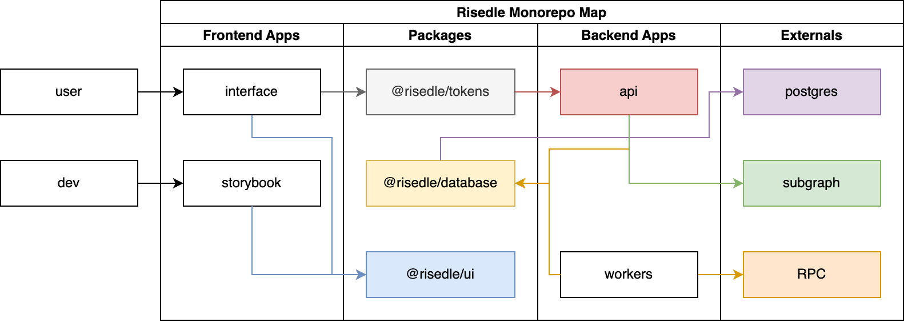

# Risedle Labs Monorepo

Welcome to Risedle Labs Monorepo!

This repository is a home of all Risedle Labs source code. We love to build on
public. This monorepo is created using [turborepo](https://turborepo.org/).

### Your Monorepomap

Looking at a bunch of directories and source codes can be intimidating
sometimes. But luckily we have provided minimap to accompany your contribution
journey:

-   **[apps](./apps)** is a home of all standalone and deployable apps that
    created by Risedle Labs team.
-   **[packages](./packages)** is a home of all libraries that used across
    projects created by Risedle Labs team.

### Useful Links

-   [Risedle Labs Website](https://risedle.com)
-   [Risedle Exchange Website](https://risedle.exchange)
-   [Risedle Exchange Storybook](https://storybook.risedle.exchange)
-   [Risedle Labs Twitter](https://twitter.com/risedle)
-   [Risedle Labs Discord](https://discord.com/invite/YCSCd97SXj)
