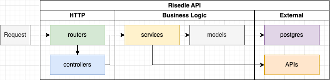

## Risedle API

This is the codebase of Risedle API.

### Project Structure

Risedle API is structured based on the flow of HTTP request:



-   **[src/server.ts](./src/server.ts)** is the entry point
-   **[src/routers](./src/routers)** maps http request to controllers
-   **[src/controllers](./src/controllers)** takes http request from routers,
    compose services call, then return http response
-   **[src/services](./src/services)** main business logic is here. Logic that
    encapsulates business requirements, calls models, calls external APIs

The `models` is provided by `@risedle/database` package, it handles schema and
the migrations.

### Deployment

Risedle API is automatically deployed via Github Actions and can be accessed
via the following URL:

-   **Production** [https://api.risedle.exchange](https://api.risedle.exchange)
-   **Staging**
    [https://apiedge.risedle.exchange](https://apiedge.risedle.exchange)

### Development

Run the following command to start development server:

```sh
pnpm dev
```

The API server will be available at
[http://localhost:3000](http://localhost:3000).

If you edit the source code, the `nodemon` will trigger build and restart your
server.
